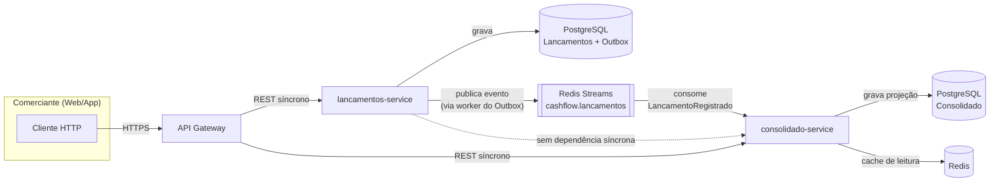
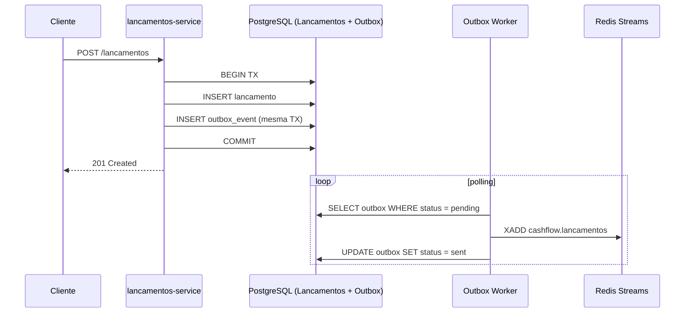
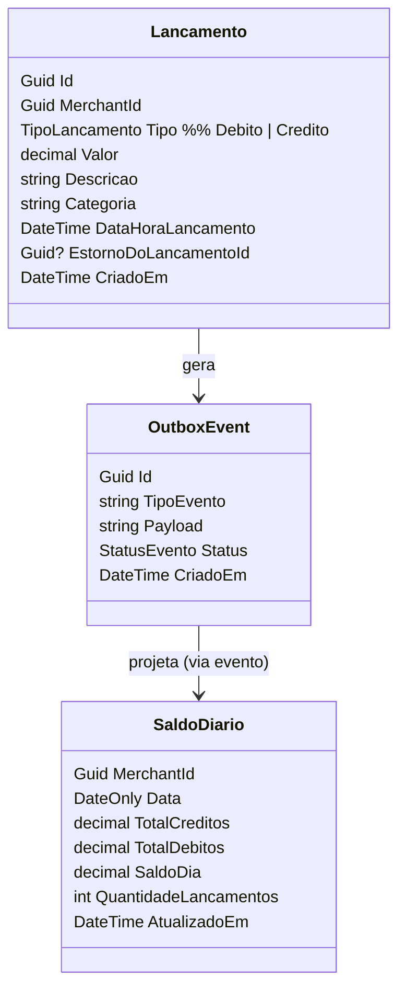
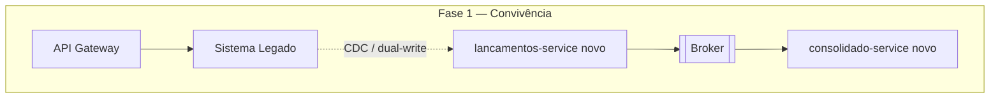

# Solução Arquitetural — Controle de Fluxo de Caixa

> Pré-requisito de leitura: [01-analise-do-desafio.md](01-analise-do-desafio.md) — este documento assume os requisitos e critérios de decisão já levantados lá.

## 1. Visão geral

Arquitetura de **dois microsserviços autônomos, desacoplados por mensageria assíncrona**, seguindo um padrão **CQRS leve**:

- **`lancamentos-service`** — write model / fonte da verdade. Registra débitos e créditos, publica eventos de domínio.
- **`consolidado-service`** — read model / projeção. Consome eventos e mantém o saldo diário consolidado, otimizado para leitura.

Os dois serviços **não se conhecem via chamada síncrona**. A única via de comunicação é um **broker de mensagens**, o que satisfaz diretamente o requisito não funcional mais crítico do desafio (NF01): a queda do `consolidado-service` não afeta a disponibilidade do `lancamentos-service`.



**Ponto central da decisão**: note que não há nenhuma seta síncrona entre `lancamentos-service` e `consolidado-service`. A única "ligação" é o broker, que é durável — se o `consolidado-service` cair, as mensagens ficam retidas na fila e são processadas quando ele voltar. O `lancamentos-service` nunca espera resposta do `consolidado-service`.

## 2. Estilo arquitetural escolhido: Microsserviços + Event-Driven (não monolito, não SOA clássico)

| Alternativa considerada | Por que foi descartada |
|---|---|
| **Monólito modular** | Não atende ao NF01 (isolamento de falha) — mesmo com módulos bem separados internamente, deploy e runtime únicos significam que um bug/sobrecarga em Consolidado pode consumir recursos (CPU, conexões de banco, threads) do processo que também serve Lançamentos. |
| **Microsserviços com comunicação síncrona (REST/gRPC direto)** | Resolveria escalabilidade, mas não resolve isolamento de falha: se Lançamentos chamasse Consolidado de forma síncrona (ou vice-versa) para qualquer fluxo crítico, uma indisponibilidade se propagaria. |
| **Serverless (FaaS) puro** | Viável e barato para a carga de 50 req/s, mas adiciona cold-start e complexidade de orquestração de estado (ledger transacional) sem ganho claro sobre containers para este domínio. Vale como variante de infraestrutura (seção 8), não como estilo. |
| **Microsserviços + Event-Driven (escolhido)** | Atende isolamento de falha (broker absorve indisponibilidade), permite escalar cada serviço de forma independente, e o padrão publish/consume é natural para o relacionamento "Consolidado deriva de Lançamentos". |

## 3. Padrões arquiteturais aplicados

### 3.1 Transactional Outbox Pattern

O maior risco técnico do design é a **dupla escrita**: gravar o lançamento no banco E publicar o evento no broker são duas operações contra dois sistemas diferentes — se a segunda falhar após a primeira ter sucesso, o evento se perde e o consolidado nunca é atualizado (inconsistência silenciosa).

**Solução**: `lancamentos-service` grava o lançamento e o evento a ser publicado **na mesma transação de banco** (tabela `outbox_events`). Um worker interno do próprio serviço lê a tabela outbox e publica no Redis Streams, marcando como enviado. Isso garante **atomicidade** entre "salvar o lançamento" e "garantir que o evento será publicado eventualmente" — sem exigir um coordenador de transação distribuída (2PC).



### 3.2 CQRS leve (Command/Query separados por serviço, não por biblioteca)

Não é CQRS "de livro" com Event Sourcing completo — é uma separação pragmática:
- `lancamentos-service` é o **command side**: valida regra de negócio, persiste em modelo normalizado (ACID).
- `consolidado-service` é o **query side**: mantém uma projeção desnormalizada (`saldo_diario` por data), otimizada para `SELECT` rápido, alimentada de forma assíncrona.

### 3.3 Idempotência no consumidor

Mensageria com garantia *at-least-once* pode entregar a mesma mensagem mais de uma vez. `consolidado-service` grava o `EventId` processado em uma tabela de controle (`processed_events`) e ignora reprocessamento do mesmo evento — evita saldo duplicado.

### 3.4 Cache-aside para leitura do saldo

Para o consolidado suportar 50 req/s de pico com folga e degradar graciosamente (tolerância de 5% de perda é aceitável, não desejável), o `GET /consolidados/{data}` primeiro consulta Redis; em cache miss, busca no PostgreSQL e populamento o cache com TTL curto (ex: 30s, já que o dado muda por eventos assíncronos). Isso reduz drasticamente a carga no banco em cenário de pico, mantendo o serviço responsivo mesmo sob stress.

### 3.5 Estorno em vez de exclusão (append-only ledger)

Lançamentos nunca são fisicamente removidos ou alterados — um estorno é um novo lançamento de sinal oposto referenciando o original (`EstornoDoLancamentoId`). Isso preserva trilha de auditoria completa, requisito implícito em qualquer domínio financeiro.

## 4. Modelo de domínio (visão simplificada)



## 5. Stack tecnológica escolhida e justificativa

| Camada | Escolha | Justificativa |
|---|---|---|
| Linguagem/Framework | **.NET 10 + ASP.NET Core Minimal APIs** | Stack moderna, produtiva e adequada para serviços HTTP pequenos. Minimal APIs reduzem cerimônia no MVP sem impedir organização interna em Clean Architecture por pastas. |
| Banco de dados (Lançamentos) | **PostgreSQL** | ACID forte para o ledger, suporte nativo a `NUMERIC` para valores monetários (evita erro de ponto flutuante), maduro, open-source, custo previsível. |
| Banco de dados (Consolidado) | **PostgreSQL** | Mesma tecnologia reduz custo operacional/cognitivo. No ambiente local, os serviços usam dois databases no mesmo servidor Postgres (`lancamentos_db` e `consolidado_db`); em produção, podem evoluir para instâncias separadas. |
| Cache | **Redis** | Padrão de mercado para cache-aside, baixíssima latência e TTL nativo para as leituras do consolidado. |
| Mensageria | **Redis Streams** | Reaproveita o Redis do ambiente local, suporta consumer groups, leitura assíncrona e ACK explícito. Para o MVP, reduz operação sem abrir mão do desacoplamento. RabbitMQ/Service Bus ficam como evolução se a exigência operacional de mensageria crescer. |
| Resiliência (client) | **Polly** | Retry com backoff exponencial, circuit breaker e timeout nas poucas integrações síncronas (ex: gateway → serviços). |
| API Gateway | **YARP** (self-hosted) ou **Azure API Management / AWS API Gateway** (gerenciado) | Ponto único de entrada, TLS termination, rate limiting, autenticação centralizada. Prefiro serviço gerenciado em produção para reduzir carga operacional. |
| Autenticação | **OAuth2 / OIDC** (ex: Azure AD B2C, Keycloak ou Auth0) | Não reinventar autenticação (é *generic subdomain*, conforme mapeamento de domínio); token JWT validado em cada serviço via middleware padrão do ASP.NET Core. |
| Containerização | **Docker + Kubernetes** (ou Azure Container Apps/AWS ECS para reduzir operação) | Deploy e scaling independentes por serviço — pré-requisito direto do NF01/NF07. Container Apps/ECS reduzem a operação de um cluster K8s completo, adequado à escala do problema (evita overengineering de infraestrutura). |
| Observabilidade | **OpenTelemetry** → Prometheus + Grafana + Loki (ou Azure Monitor/Application Insights, se Azure) | Padrão aberto, vendor-neutral, portável entre clouds. |
| Testes | **xUnit** (unitários de backend) | O MVP prioriza testes das regras de domínio e aplicação. Testcontainers e k6 ficam como evolução para validação de integração e carga. |

## 6. APIs (contrato simplificado)

**`lancamentos-service`**
```
POST   /api/v1/lancamentos              -> registra débito/crédito
POST   /api/v1/lancamentos/{id}/estorno -> estorna um lançamento
GET    /api/v1/lancamentos?de=&ate=&tipo=&categoria=&page= -> consulta paginada
GET    /api/v1/lancamentos/{id}         -> detalhe
```

**`consolidado-service`**
```
GET    /api/v1/consolidados/{data}       -> saldo consolidado do dia
GET    /api/v1/consolidados?de=&ate=     -> série histórica
```

Ambos expõem `/health/live` e `/health/ready` (health checks padrão do ASP.NET Core) para orquestração no Kubernetes/Container Apps.

## 7. Como os requisitos não funcionais são atendidos

| NFR | Mecanismo |
|---|---|
| **NF01** — Lançamentos disponível mesmo com Consolidado indisponível | Comunicação 100% assíncrona via Redis Streams; Lançamentos nunca faz chamada bloqueante para Consolidado. Outbox garante que o evento não se perde mesmo que o Redis esteja temporariamente indisponível (fica retido até o worker conseguir publicar). |
| **NF02** — 50 req/s de pico, ≤5% perda | Cache-aside no `GET /consolidados`, réplicas de leitura do Postgres, autoscaling horizontal (HPA por CPU/latência), rate limiting no gateway para proteger o serviço em picos anormais (rejeita excedente de forma controlada — perda "planejada" dentro do orçamento de 5%, em vez de queda total). |
| **NF03** — Auditabilidade | Ledger append-only, estorno em vez de update/delete, `CriadoEm` imutável, log estruturado de toda escrita. |
| **NF04** — Consistência forte na escrita / eventual na leitura | PostgreSQL transacional no write model; projeção assíncrona explicitamente documentada como eventualmente consistente (SLA de propagação: segundos). |
| **NF05** — Segurança | Ver seção 9. |
| **NF06** — Observabilidade | Ver seção 8.3. |
| **NF07** — Escalabilidade independente | Deploy, pipeline CI/CD, banco e scaling policy independentes por serviço. |

## 8. Infraestrutura, escalabilidade e resiliência

### 8.1 Escalabilidade
- Serviços stateless → scaling horizontal trivial (réplicas atrás de load balancer).
- `consolidado-service` escala mais agressivamente no eixo de leitura (réplicas de API + réplica de leitura do Postgres + Redis), já que concentra o tráfego de pico (50 req/s).
- Redis Streams com consumer group permite múltiplos consumidores de `consolidado-service` processando eventos sem duplicar efeito no saldo, desde que a idempotência por `EventId` seja preservada (seção 3.3).

### 8.2 Resiliência
- **Health checks** (liveness/readiness) para o orquestrador substituir instâncias travadas.
- **Circuit breaker (Polly)** nas poucas dependências síncronas (ex: chamada ao IdP para introspecção de token).
- **ACK após commit** no consumidor: mensagens do Redis Streams só são reconhecidas após a atualização do PostgreSQL e o registro em `processed_events`. Eventos pendentes podem ser recuperados com `XAUTOCLAIM` como evolução operacional.
- **Multi-AZ** (múltiplas zonas de disponibilidade) para banco e réplicas de serviço, mitigando falha de infraestrutura localizada.
- **Reprocessamento administrativo** pode ser adicionado como evolução para reconstruir a projeção a partir do ledger de Lançamentos (fonte da verdade), sendo a rede de segurança final caso a projeção fique inconsistente por qualquer motivo.

### 8.3 Observabilidade
- **Tracing distribuído** (OpenTelemetry): um `TraceId`/`CorrelationId` gerado na entrada do gateway atravessa a chamada HTTP e é propagado como atributo da mensagem no Redis Streams, permitindo correlacionar "lançamento X gerou a atualização Y do consolidado" mesmo sendo assíncrono.
- **Métricas chave**: taxa de requisições e latência p95/p99 por serviço, mensagens pendentes no Redis Streams, taxa de erro, cache hit ratio no Redis, lag de consumo de eventos.
- **Logs estruturados** (JSON) centralizados, correlacionados por `TraceId`.
- **SLOs sugeridos**: Lançamentos p99 < 300ms na escrita; Consolidado p99 < 200ms na leitura (com cache); propagação evento → projeção < 5s em 99% dos casos.
- **Alertas**: mensagens pendentes acima do normal (indica consumidor lento/fora do ar), taxa de erro 5xx acima de threshold, falhas repetidas no processamento de eventos.

## 9. Segurança

- **AuthN/AuthZ**: OAuth2/OIDC com JWT; escopos distintos para operações de escrita (`lancamentos:write`) e leitura (`consolidado:read`), permitindo integrações de terceiros com permissão mínima necessária (least privilege).
- **Transporte**: TLS 1.2+ obrigatório em todas as comunicações externas (cliente → gateway → serviços); mTLS entre serviços internos se o ambiente exigir zero-trust.
- **Dados em repouso**: criptografia nativa do banco gerenciado (encryption at rest); campos sensíveis adicionais (se houver dados de identificação do comerciante) com criptografia em nível de coluna.
- **Redis**: autenticação por credenciais/certificado, streams isolados por ambiente, persistência configurada e sem acesso público direto (dentro da rede privada/VPC).
- **API Gateway**: rate limiting por cliente/IP, validação de payload (schema), proteção contra abuso (WAF gerenciado, se disponível na cloud escolhida).
- **Auditoria de acesso**: todo endpoint de escrita loga `who/when/what` (identidade do token, timestamp, operação), separado dos logs de aplicação, com retenção adequada a requisitos de compliance financeiro.
- **Segredos**: gerenciados por cofre de segredos (Azure Key Vault / AWS Secrets Manager / HashiCorp Vault), nunca em variável de ambiente em texto plano nos manifests versionados.

## 10. Evoluções futuras

Registradas aqui por transparência de escopo, não implementadas no MVP:

- **Event Sourcing completo** no `lancamentos-service` (histórico de eventos como fonte da verdade, em vez de estado atual) — traria replay total e novos read models sem migração, mas foi descartado no MVP por complexidade desproporcional à necessidade atual.
- **Multi-tenant real** (múltiplos comerciantes/lojas), já preparado no modelo de dados via `MerchantId`, mas sem isolamento de tenant em nível de banco/schema implementado ainda.
- **Migração para RabbitMQ, Azure Service Bus ou Kafka** se surgir necessidade operacional mais forte de mensageria dedicada, múltiplos consumidores independentes, DLQ gerenciada ou replay de longo prazo.
- **Exportação de relatórios** (CSV/PDF) e dashboards diretamente no `consolidado-service`.
- Definição formal de **política de retenção de dados** e enquadramento LGPD junto ao time de negócio/jurídico (ponto assumido em aberto na análise).

## 11. Arquitetura de transição (requisito diferencial)

O enunciado não afirma explicitamente que existe um sistema legado, mas é comum que o comerciante já controle o fluxo de caixa hoje de forma manual (planilha) ou em um sistema monolítico simples. Cubro os dois cenários:

**Cenário A — hoje é manual (planilha/caderno)**
Não há "legado" técnico a migrar; a transição é apenas de processo (onboarding do comerciante na nova ferramenta). Sem impacto arquitetural — não é necessário desenho de transição, apenas um plano de importação inicial de dados (endpoint de import em lote no `lancamentos-service`).

**Cenário B — já existe um sistema legado (ex: monólito com uma tabela `lancamentos` e um relatório acoplado)**
Aplico o padrão **Strangler Fig**: a nova arquitetura é introduzida ao lado do legado e assume responsabilidades progressivamente, sem big-bang.



1. **Fase 1 — Convivência**: o `lancamentos-service` novo é implantado e passa a receber gravações via *dual write* (ou *Change Data Capture* na base legada), alimentando o broker. O `consolidado-service` novo já nasce lendo apenas do modelo novo, sendo validado em paralelo ao relatório legado (comparação de saldos como critério de aceite).
2. **Fase 2 — Corte de leitura**: o gateway passa a rotear leituras de consolidado para o serviço novo; o legado deixa de ser fonte de relatório.
3. **Fase 3 — Corte de escrita**: todo registro de lançamento passa a ir direto para o `lancamentos-service` novo; o dual-write/CDC é desligado.
4. **Fase 4 — Descomissionamento**: sistema legado é desativado após período de retenção/auditoria dos dados históricos migrados.

Esse caminho evita indisponibilidade durante a migração e permite rollback em qualquer fase (basta voltar o roteamento do gateway para o legado).

## 12. Estimativa de custos (requisito diferencial)

Estimativa mensal aproximada em nuvem pública (ordem de grandeza, não cotação formal), assumindo a carga descrita (50 req/s de pico, uso de comerciante único/pequena escala — não enterprise):

| Item | Dimensionamento | Estimativa mensal (USD) |
|---|---|---|
| Compute (2 serviços, containers gerenciados, 2 réplicas cada, baixo consumo) | ~4 instâncias pequenas (0.5-1 vCPU / 1GB) | ~$60–120 |
| PostgreSQL gerenciado (Lançamentos) | Instância pequena (2 vCPU/4GB) + backup | ~$50–80 |
| PostgreSQL gerenciado (Consolidado) + 1 réplica de leitura | Instância pequena + réplica | ~$70–110 |
| Redis gerenciado | Instância pequena (cache) | ~$15–30 |
| Redis gerenciado (Streams + cache) | Instância pequena com persistência adequada | ~$15–40 |
| API Gateway gerenciado | Baseado em nº de requisições (baixo volume) | ~$5–20 |
| Observabilidade (logs/métricas/tracing) | Retenção padrão, volume baixo | ~$20–50 |
| IdP (autenticação) | Tier gratuito/básico para poucos usuários | $0–20 |
| **Total estimado** | | **~$230–470/mês** |

Licenças: toda a stack proposta (.NET, PostgreSQL, Redis, OpenTelemetry, Kubernetes) é **open-source / sem custo de licenciamento**; o custo é 100% de infraestrutura gerenciada. Isso é uma escolha deliberada para manter o TCO (Total Cost of Ownership) baixo e proporcional à escala do problema — evitando licenciamento de software proprietário (ex: banco comercial, ESB proprietário) que não se justificaria para 50 req/s de pico.

> Nota: valores são uma ordem de grandeza ilustrativa para fins de discussão arquitetural, variam conforme provedor (AWS/Azure/GCP), região e política de desconto — não substituem uma cotação formal com o time de FinOps.
